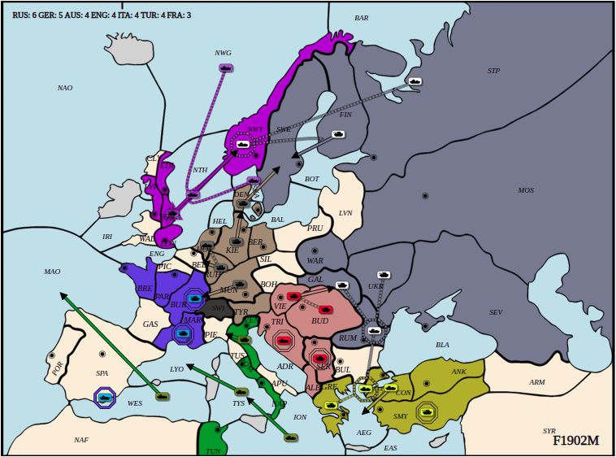

# LLM-based Models for No Press Diplomacy

This is a simple version of strategic reasoning for no-press diplomatic games based on LLM. LLM Agents will output action commands in a fixed format to control a certain country to confront other agents
<p align="center">
  
</p>

The definition and operation of an llm-based agent in a game code in [the folder](diplomacy_research/diplomacy_sample).


## Installation

#### Clone the repo with submodules:

```python3
git clone https://github.com/ruiandshuai/ruiandshuai-diplomacy-research-sample.git
cd diplomacy-research
```
#### The repository can be installed in a conda environment with:
```python3
# Create conda env
conda create -n diplomacy python=3.8
conda activate diplomacy

# Install python requirements
pip install --no-deps -r requirements.txt

```

The package is compatible with Python 3.8


### Playing against the Ruled-based agents
We use prompt words to tell the LLM about the rules and game status of the game. Finally, the LLM Agent responds to the action command, thereby interacting with the environment.

Play a diplomatic game by using the azure_agent from [azure_vs_rele.py](diplomacy_research/diplomacy_sample/tests/azure_vs_rule.py) against the ruled based agent.
Modify the file paths in the code of the two files: 
- [diplomacy_research/diplomacy_sample/agents/llm_agents/azure_agent.py](diplomacy_research/diplomacy_sample/agents/llm_agents/azure_agent.py)
- [diplomacy_research/diplomacy_sample/tests/azure_vs_rule.py](diplomacy_research/diplomacy_sample/tests/azure_vs_rule.py)

to `'/Your/project/diplomacy-research'`
```python3
conda activate diplomacy
cd diplomacy-research/diplomacy_research/diplomacy_sample
```bash
# The example uses AzureChatOpenAI
export AZURE_DEPLOYMENT_NAME="gpt-4.1-2025-04-14" 
export AZURE_API_KEY=<Your AZURE_API_KEY>
export AZURE_API_ENDPOINT="https://api.tonggpt.mybigai.ac.cn/proxy/eastus2"
export AZURE_API_VERSION="2025-03-01-preview"
export PROTOCOL_BUFFERS_PYTHON_IMPLEMENTATION=cpp
# 
python tests/azure_vs_rule.py
```